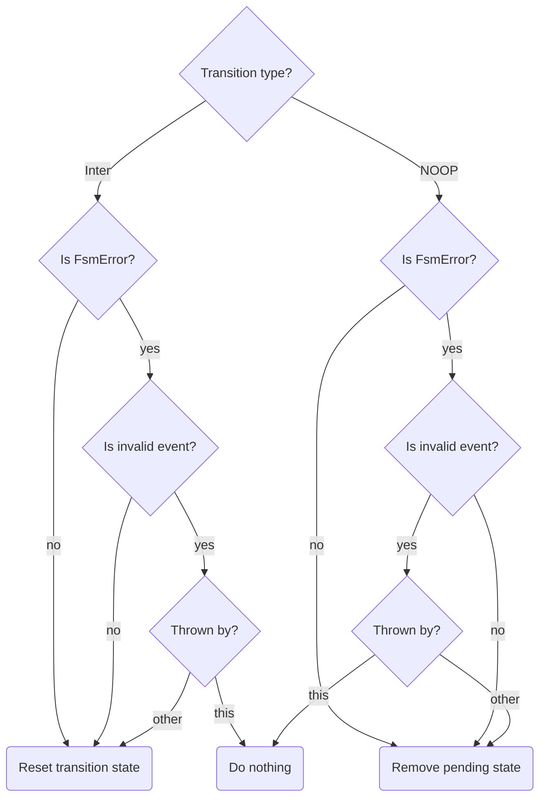

```mermaid
graph TD
transitionType{Transition type?}

eventTypeInter{Is FsmError?}
eventTypeNoop{Is FsmError?}

invalidEventInter{Is invalid event?}
invalidEventNoop{Is invalid event?}

currentFsmInter{Thrown by?}
currentFsmNoop{Thrown by?}

doNothing(Do nothing)

cleanupInter(Reset transition state)
cleanupNoop(Remove pending state)

transitionType --> |Inter|eventTypeInter
transitionType --> |NOOP|eventTypeNoop

eventTypeInter --> |no|cleanupInter
eventTypeInter --> |yes|invalidEventInter

invalidEventInter --> |no|cleanupInter
invalidEventInter --> |yes|currentFsmInter

currentFsmInter --> |other|cleanupInter
currentFsmInter --> |this|doNothing

eventTypeNoop --> |no|cleanupNoop
eventTypeNoop --> |yes|invalidEventNoop

invalidEventNoop --> |no|cleanupNoop
invalidEventNoop --> |yes|currentFsmNoop

currentFsmNoop --> |other|cleanupNoop
currentFsmNoop --> |this|doNothing
```
